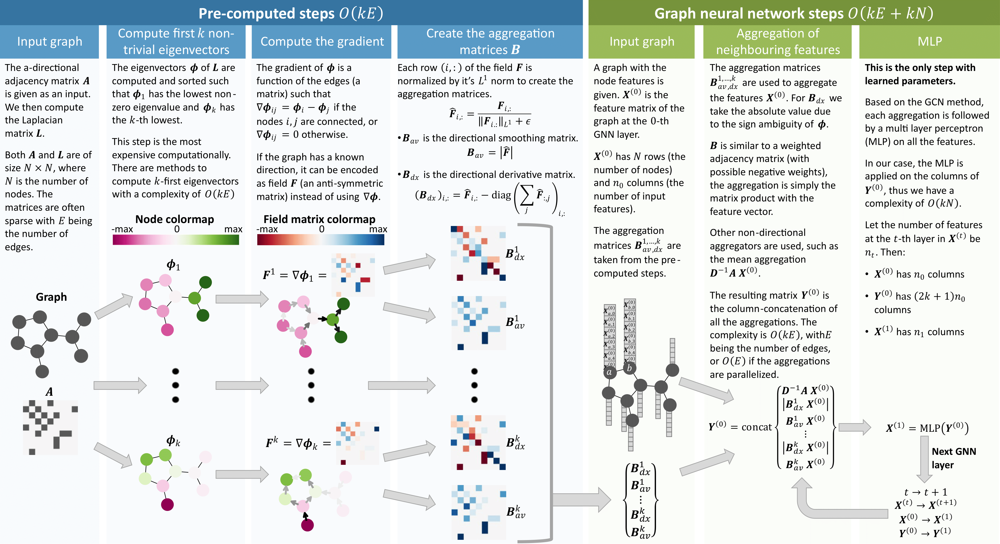

# Recreating *.pkl data
The data files from the [original repo](https://github.com/Saro00/DGN) have the following error with DGL-0.5+:

> pickle.load(f)ModuleNotFoundError: No module named 'dgl.graph'

Steps to generate a new format *.pkl file:
1. download raw data from [Benchmarking GNNs](https://github.com/graphdeeplearning/benchmarking-gnns) and put it in Dir: **raw_data**.
2. Run prepare_pkl.py


# Directional Graph Networks

Implementation of Directional Graph Networks in PyTorch and DGL.



## Overview

We provide the implementation of the Directional Graph Networks (DGN) in PyTorch and DGL frameworks, along with scripts for running real-world benchmarks. The repository is organised as follows:

- `models` contains:
  - `pytorch` contains the various GNN models implemented in PyTorch: the implementation of the aggregators, the scalers, the DGN layer and the directional aggregation matrix (`eigen_agg`).
  - `dgl` contains the DGN model implemented via the [DGL library](https://www.dgl.ai/): aggregators, scalers, and DGN layer.
  - `layers.py` contains general NN layers used by the various models
- `realworld_benchmark` contains various scripts from [Benchmarking GNNs](https://github.com/graphdeeplearning/benchmarking-gnns) 
and [Open Graph Benchmark](https://ogb.stanford.edu/) to download the real-world benchmarks and train the DGN on them. 
In `realworld_benchmark/README.md` we provide instructions for runnning the experiments.

## Reference
```
@article{beaini2020directional,
  title={Directional graph networks},
  author={Beaini, Dominique and Passaro, Saro and L{\'e}tourneau, Vincent and Hamilton, William L and Corso, Gabriele and Li{\`o}, Pietro},
  journal={arXiv preprint arXiv:2010.02863},
  year={2020}
}
```

## License
MIT
